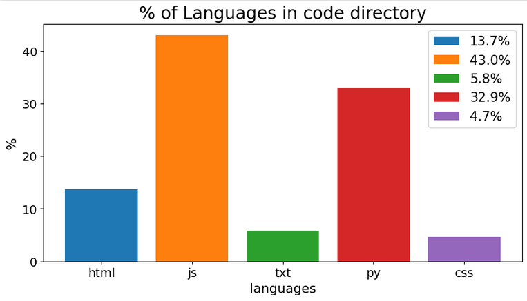

## Scan folder
This utility program scans a folder for code related files e.g. Python, C#, Javescript, txt, csv, SQL, etc 
It outputs a bar chart of the volume of the different code language in that folder. 
This may help you inspect and manage code folders as project grows.  
NOTE:  Non-code related files are not included in calculations or output. 

## How to use
- Assuming you have python on your PC
- Place the file "scanFolder.py" in same folder that contains other folders you want to scan. 
- In the command prompt, make sure you are in correct folder. To run, type... py scanFolder.py   
- Enter folder name when prompted.  
- Depending on folder size, it normally runs in a few seconds to display the output text and bar chart 
- Click on the bar chart icon on taskbar to view the bar chart. 
- Additionally a folder named "SCAN" will be auto-created to save the chart image. 
- In this GIT download, there are 2 sample folders (CODE, CODE2) provided, to try out.

## Example bar chart, Distribution of code types

     
## Technical info
- Modules used: os, sys, mathplotlib, datetime
- Uses file operations to read and count code lines and save image.
- The calculation is based of the number of code lines, not on number of files or file size.
- Extensive use of list and dictionary comprehensions to transform, filter and calculate. 
- Two levels of filtering;
  - detect and exclude folders and hidden files
  - detect and exclude non-code files   
- Less than 90 lines of code
- Saved as a Python script
- Comments included for user to modify as needed.
